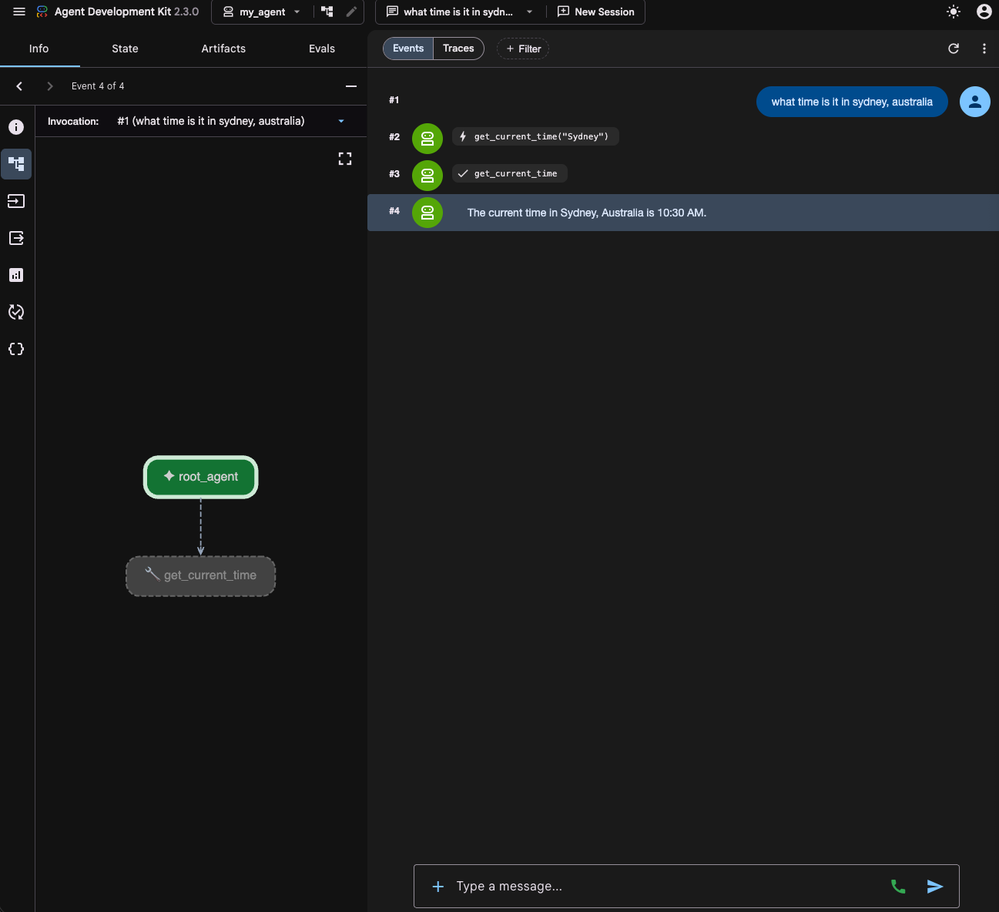

# ADK

Investigation of [Agent Development Kit Python Quickstart](https://adk.dev/get-started/python/)

The directory [`./my_agent`](./my_agent) was created with:

```bash
pyenv virtualenv 3.14 adk
pyenv activate adk
pip install google-adk
adk create my_agent
```


## Testing

### CLI
```
GOOGLE_GENAI_USE_ENTERPRISE=1
GOOGLE_CLOUD_PROJECT=system-alexb-art-ed9d
GOOGLE_CLOUD_LOCATION=europe-west2
adk run my_agent 2>&1
Log setup complete: /var/folders/wl/r9gvddvj5gs7vg94hm2jzdgh0000gp/T/agents_log/agent.20260701_212620.log
To access latest log: tail -F /var/folders/wl/r9gvddvj5gs7vg94hm2jzdgh0000gp/T/agents_log/agent.latest.log
Running agent root_agent, type exit to exit.
what time is it in brighton, england
[root_agent]: The current time in Brighton, England is 10:30 AM.
what time is it in kansas city, missouri
[root_agent]: The current time in Kansas City, Missouri is 10:30 AM.
is it always 10:30 AM?
[root_agent]: No, it is not always 10:30 AM! Time continuously moves forward.

It just so happened that when you asked for the time in Brighton and then in Kansas City, the tool returned 10:30 AM (perhaps due to the simulated nature of this environment or a coincidence in when the queries were processed). In reality, Kansas City and Brighton are in different time zones (Brighton is on Greenwich Mean Time/British Summer Time, while Kansas City is on Central Standard Time/Central Daylight Time), so they would normally show different times!
```

### Web
```
adk web --port 8080
```

Then visit http://127.0.0.1:8080



## Questions

* How does the agent SDK interact with agent engine? Are there dependencies?
* Is it a requirement for playground?
* Does it instrument the application with opentel?